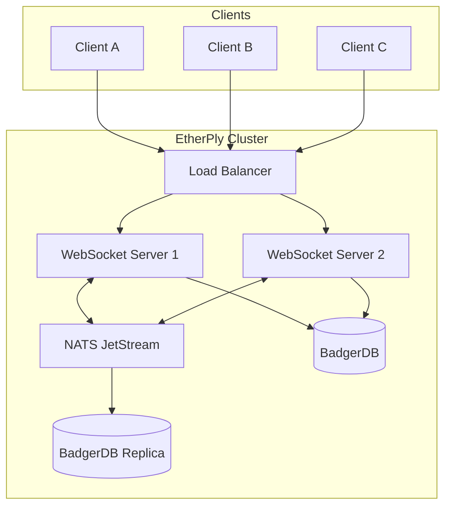
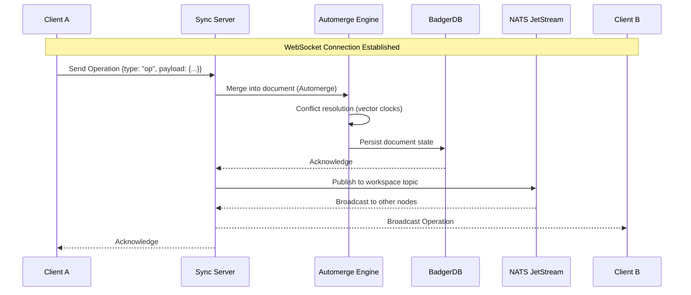
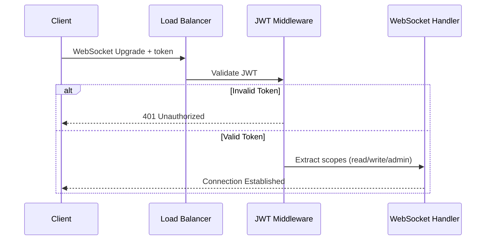

# System Architecture

> [!NOTE]
> **Current State:** Post "Operation Ironclad" (Q1-Q3 2026). This document describes the production architecture with:
> - **Automerge CRDT** for conflict-free synchronization
> - **BadgerDB** for ACID-compliant persistence
> - **NATS JetStream** for multi-region replication
> - **Pluggable sync strategies** (CRDT, LWW, Server-Authoritative)

## High-Level Overview

EtherPly follows a **Hub-and-Spoke** architecture where sync servers coordinate state between connected clients via WebSockets.

### Architecture Diagram



### Data Flow Sequence



## Key Concepts

### 1. The Workspace
A **Workspace** is the fundamental unit of isolation. It represents a single collaborative document or room.
- Identified by a unique `workspace_id` (string)
- State is atomic per workspace; operations in Workspace A do not affect Workspace B
- Each workspace has its own Automerge document

### 2. Sync Strategies

EtherPly supports pluggable sync strategies:

| Strategy | Use Case | Characteristics |
|----------|----------|-----------------|
| **Automerge CRDT** | Collaborative editing, offline-first | Mathematically correct convergence, no data loss |
| **Last-Write-Wins (LWW)** | Simple apps, lower latency | Faster, but may lose concurrent edits |
| **Server-Authoritative** | Gaming, anti-cheat | Server is source of truth |

Configuration via environment:
```bash
ETHERPLY_SYNC_STRATEGY=automerge  # or: lww, server-auth
```

### 3. The Operation (Op)
State changes are transmitted as **Operations**.

```json
{
  "type": "op",
  "payload": {
    "key": "string",
    "value": "any",
    "timestamp": 123456789
  }
}
```

> [!IMPORTANT]
> **Timestamp Format**: Unix Microseconds
> - JavaScript: `Date.now() * 1000`
> - Go: `time.Now().UnixMicro()`

### 4. Presence
Presence represents ephemeral state (e.g., "User A is online", "User B is typing").
- Stored in-memory only
- Not persisted to disk
- Broadcast to all connected clients in the same workspace
- Automatically cleaned up on disconnect

### 5. Persistence (BadgerDB)

We use **BadgerDB v4** for production-grade persistence:

| Property | Description |
|----------|-------------|
| ACID Compliance | Full transaction support |
| Crash Recovery | Automatic via Write-Ahead Log |
| Concurrent Access | MVCC transactions (no global lock) |
| Performance | 3x faster writes than LevelDB |

### 6. Multi-Region Replication (NATS JetStream)

Cross-datacenter synchronization via NATS JetStream:
- Exactly-once delivery guarantees
- Configurable retention (stream-based or interest-based)
- Cloud-native (Kubernetes-ready)

## Conflict Resolution: Automerge CRDT

EtherPly uses **Automerge**, a mature CRDT implementation:

```go
// Merge two concurrent edits - always converges
localDoc.Merge(remoteDoc)
```

Properties:
- **Commutative**: Order of merge doesn't matter
- **Associative**: Grouping of merges doesn't matter
- **Idempotent**: Re-merging has no effect

### Vector Clocks
Automerge tracks causality via vector clocks (Heads):
```go
heads := doc.Heads() // Returns the current vector clock
```

This enables:
- Delta sync (only send changes since last seen heads)
- Causal ordering of operations
- Detection of concurrent edits

## Security Architecture

### Authentication Flow


### Scopes
- `read`: Can subscribe to workspace updates
- `write`: Can send operations
- `admin`: Can manage workspace settings

## Scaling Considerations

| Metric | Single Node | Clustered (3 nodes) |
|--------|-------------|---------------------|
| Concurrent connections | 5,000 | 15,000+ |
| Operations/second | 10,000 | 30,000+ |
| Latency (p99) | &lt;50ms | &lt;100ms (cross-node) |

### Horizontal Scaling
1. Add more WebSocket nodes behind load balancer
2. Configure sticky sessions (by workspace_id)
3. NATS JetStream handles cross-node message propagation
4. BadgerDB can be sharded by workspace prefix
