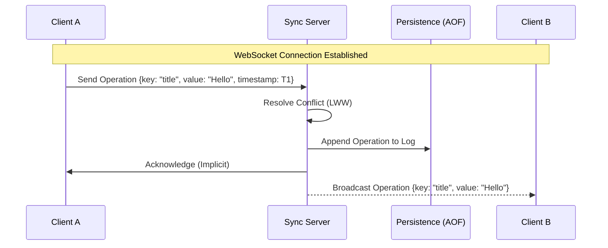

# System Architecture

> [!NOTE]
> This document describes the high-level design of the EtherPly Real-time Sync Engine. It is intended for system architects and contributors.

## High-Level Overview

EtherPly follows a **Hub-and-Spoke** architecture where a central Sync Server coordinates state between connected Clients (WebSockets).

### Data Flow Diagram



## Key Concepts

### 1. The Workspace
A **Workspace** is the fundamental unit of isolation. It represents a single collaborative document or room.
- Identified by a unique `workspace_id` (string).
- State is atomic per workspace; operations in Workspace A do not affect Workspace B.

### 2. The Operation (Op)
State changes are transmitted as **Operations**.
- **Structure**:
  ```json
  {
    "type": "op",
    "payload": {
      "key": "string",       // The property being changed
      "value": "any",        // The new value
      "timestamp": 123456789 // Unix Microseconds (Critical for LWW)
    }
  }
  ```
- **Idempotency**: Operations are idempotent. Re-applying the same operation with the same timestamp has no side effects.

### 3. Presence
Presence represents ephemeral state (e.g., "User A is online", "User B is typing").
- stored in-memory only.
- Not persisted to disk.
- Broadcast to all connected clients in the same workspace.

### 4. Persistence Methodology
We currently use **Append-Only File (AOF)** persistence.
- **Why?** MVP Simplicity and Durability.
- **Mechanism**: Every valid operation is serialized (Gob) and appended to a local file.
- **Recovery**: On startup, the server reads the AOF from beginning to end to reconstruct the in-memory state.

## Conflict Resolution: Last-Write-Wins (LWW)

EtherPly uses a simplified CRDT approach known as **Last-Write-Wins Register**.
- Every key in the state map is a register.
- When an update arrives, we compare its `timestamp` with the current local timestamp for that key.
- **Rule**: `if incoming.Timestamp > current.Timestamp { apply() }`
- **Edge Case**: If timestamps are equal, we can use a deterministic tie-breaker (e.g., lexographic sort of User ID or Value), though currently, implementation may depend on arrival order (see `crdt/engine.go`).

> [!WARNING]
> **Clock Skew**: LWW relies on client clocks. Significant clock skew can result in "lost updates" (an "older" operation from a fast clock overwriting a "newer" operation from a slow clock). Clients should ideally sync with NTP, but for this MVP, we assume reasonable system time accuracy.
