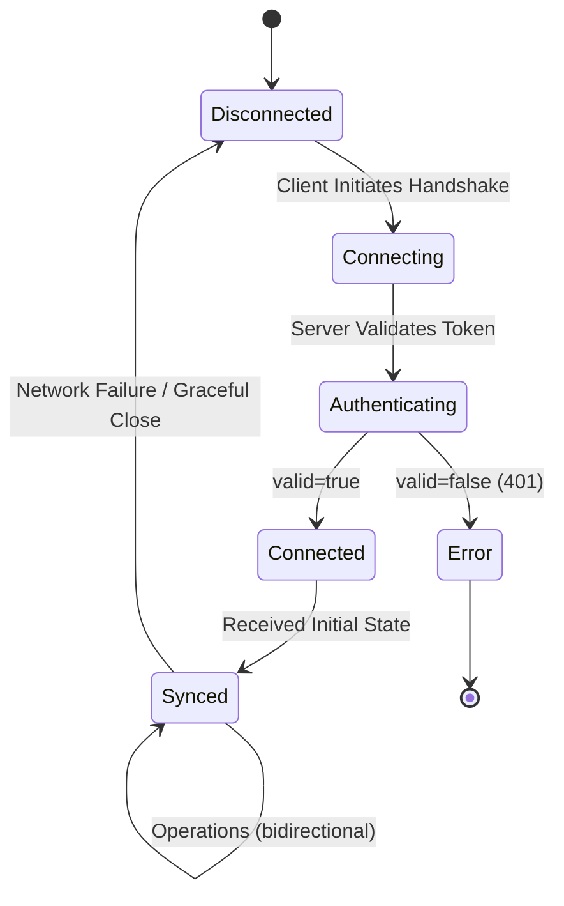

# EtherPly Sync Server Specification

> [!IMPORTANT]
> This document is the **Source of Truth**. If the code contradicts this document, the code is a defect.

## 1. User Stories (Gherkin)

```gherkin
Feature: Real-time Workspace Synchronization

  Scenario: Client Connects Successfully
    Given a valid JWT signed with the server's secret
    And a target Workspace ID "workspace-123"
    When the client initiates a WebSocket connection to "/v1/sync/workspace-123"
    Then the server accepts the connection with HTTP 101 Switching Protocols
    And the client receives an "init" message with current state
    And the client enters the "Connected" state

  Scenario: Client Fails Authentication
    Given a missing or invalid JWT
    When the client initiates a WebSocket connection
    Then the server rejects the handshake with HTTP 401 Unauthorized
    And the connection is closed immediately

  Scenario: Client Sends Operation
    Given a connected session with "write" scope
    When the client sends an "op" message with key "foo" and value "bar"
    Then the server persists the operation using Automerge CRDT
    And the server broadcasts this message to all clients in "workspace-123"
    And the webhook (if configured) receives a "doc.updated" event

  Scenario: Read-Only Client Attempts Write
    Given a connected session with "read" scope only
    When the client sends an "op" message
    Then the server responds with an "error" message
    And the operation is not persisted
```

## 2. State Machine



## 3. Data Contracts

### Client → Server

```json
{
  "type": "op",
  "payload": {
    "key": "string (Required)",
    "value": "any (Required)",
    "timestamp": "integer (Optional - Unix Microseconds)"
  }
}
```

### Server → Client (Init)

```json
{
  "type": "init",
  "data": { "...current state..." },
  "heads": ["change-hash-1", "change-hash-2"]
}
```

### Server → Client (Broadcast)

```json
{
  "type": "op",
  "payload": {
    "key": "string",
    "value": "any",
    "timestamp": "integer"
  }
}
```

## 4. Technical Implementation

| Component | Technology | Notes |
|-----------|------------|-------|
| Conflict Resolution | Automerge CRDT | Automatic merge without data loss |
| Persistence | BadgerDB v4 | ACID-compliant, embedded |
| Auth | JWT (HS256) | Scopes: `read`, `write`, `admin` |
| Transport | WebSocket | JSON payloads |

## 5. Out of Scope (Current Version)

- ~~Complex RBAC~~ **IMPLEMENTED** (read/write scopes)
- ~~Multi-Region Replication~~ **IMPLEMENTED** (via NATS JetStream)
- ~~History/Undo~~ **IMPLEMENTED** (via `/v1/history/{workspace_id}`)
- **Schema Validation** - Server does not validate `value` content

## 6. Error Codes

| Code | Trigger |
|------|---------|
| 401 | Missing/invalid JWT |
| 403 | Write attempted with read-only scope |
| 500 | Internal error (persistence failure) |

