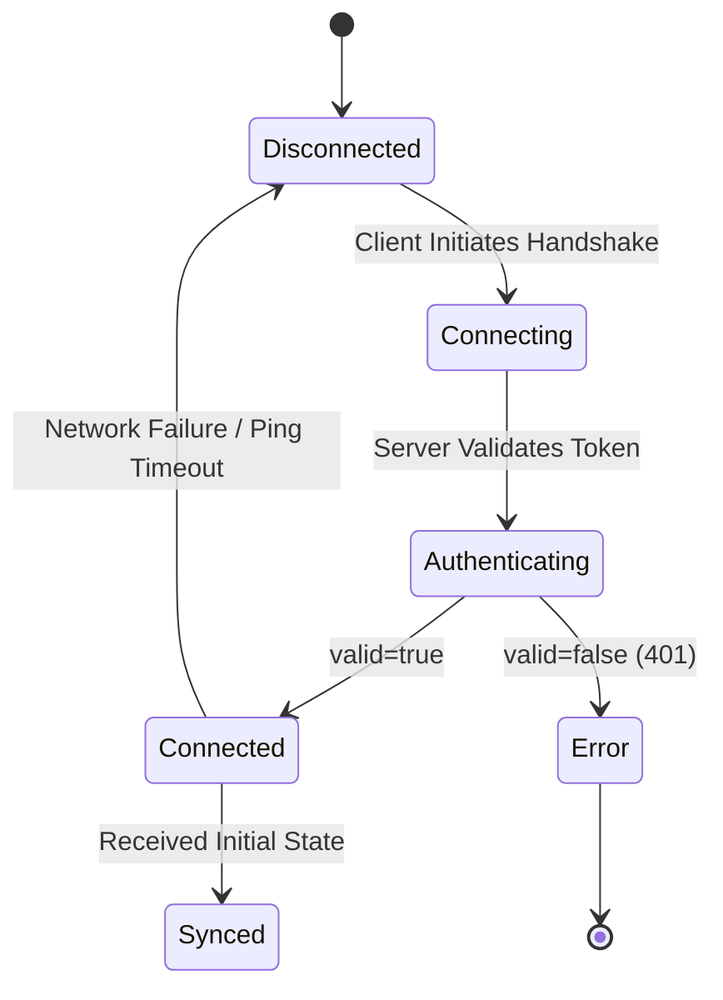

# EtherPly Sync Server Specification (The "Mega-Ticket")

> [!IMPORTANT]
> This document is the **Source of Truth**. If the code contradicts this document, the code is a defect.

## 1. The Mega-Ticket (The Spec)

### User Stories (Gherkin)

```gherkin
Feature: Real-time Workspace Synchronization

  Scenario: Client Connects Successfully
    Given a valid JWT signed with the server's secret
    And a target Workspace ID "workspace-123"
    When the client initiates a WebSocket connection to "/v1/sync/workspace-123"
    Then the server accepts the connection with HTTP 101 Switching Protocols
    And the client enters the "Connected" state

  Scenario: Client Fails Authentication
    Given a missing or invalid JWT
    When the client initiates a WebSocket connection
    Then the server rejects the handshake with HTTP 401 Unauthorized
    And the connection is closed immediately

  Scenario: Client Sends Operation
    Given a connected session
    When the client sends an "op" message with key "foo" and value "bar"
    Then the server broadcasts this message to all other clients in "workspace-123"
    And the server persists this state to the AOF file
```

### The State Machine



### Data Contracts (JSON Payload)

**Direction: Client -> Server**

```json
{
  "type": "op",
  "payload": {
    "key": "string (Required)",
    "value": "any (Required - string, number, boolean, object, or null)",
    "timestamp": "integer (Required - Unix Microseconds)"
  }
}
```

**Direction: Server -> Client (Broadcast)**

```json
{
  "type": "op",
  "payload": {
    "key": "string",
    "value": "any",
    "timestamp": "integer"
  }
}
```

## 2. The N Constraint (The Scope)

### The Iron Boundary (Out of Scope)
The following are strictly **OUT OF SCOPE** for the current version. Any discussion regarding these features will be blocked.

1.  **Complex RBAC**: We do not distinguish between "Editors" and "Viewers". If you have a token, you can write.
2.  **Multi-Region Replication**: The server assumes a single instance writer (per workspace). Distributed consensus is not implemented.
3.  **History/Undo**: The server stores LWW (Last-Write-Wins). It does not maintain an operation log for undo functionality.
4.  **Schema Validation**: The server does not validate the content of `value`. It is a dumb pipe.

## 3. The Ambiguity Audit (QA Prep)

### Error State Dictionary

| Code | Message / Symptom | Trigger Condition |
| :--- | :--- | :--- |
| **401** | `Unauthorized` | Missing `token` query param or invalid signature. |
| **500** | `Internal Server Error` | Unexpected panic or AOF write failure. |
| **N/A** | `connection refused` | Server process is not running. |
| **N/A** | `address already in use` | Port `8080` is occupied by a zombie process. |

### Empty States
*   **New Workspace**: If a client connects to a Workspace ID that has never been seen, the server initializes it with an empty state map `{}`. No error is returned.
