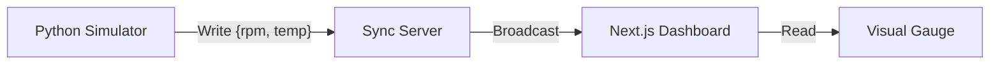

# EtherPly Example: IoT Dashboard

> **Concept**: Demonstrates **Cross-Language Synchronization**. A Python producer (simulating a factory sensor) streams data to a React/Next.js consumer.

## Architecture

Synchronizing state across different programming languages/runtimes using the unified EtherPly protocol.



## Run It

### 1. Prerequisites
- **EtherPly Server** running (`:8080`).

### 2. Start Dashboard (Consumer)
```bash
cd dashboard
npm install
npm run dev
```
Open `http://localhost:3000`. Use specific URL if Next.js picks a different port.

### 3. Start Simulator (Producer)
```bash
cd devices
# Recommend virtualenv
python3 -m venv venv && source venv/bin/activate
pip install -r requirements.txt
python main.py
```

### 4. Verify
1. `main.py` output: "Emitting metrics..."
2. Dashboard gauges should animate in real-time.

## Troubleshooting

### Dashboard is static
**Cause**: `main.py` not running.
**Fix**: Ensure Python simulator is active.

### Python "Connection Refused"
**Cause**: Sync Server (`:8080`) is down.
**Fix**: Start `etherply-sync-server`.
