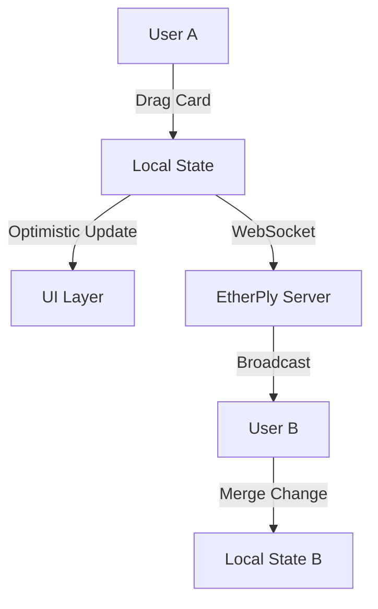

# EtherPly Example: Kanban Board

> **Concept**: A collaborative Kanban board demonstrating **complex nested state synchronization** (arrays of objects) and **optimistic UI updates** for drag-and-drop interactions.

## Architecture

We treat the entire board as a single CRDT document.



### Data Structure
```ts
interface KanbanState {
  columns: {
    id: string;
    title: string;
    cardIds: string[]; // Order preserved via array index
  }[];
  cards: Record<string, Card>; // Normalized data
}
```

## Run It

### 1. Prerequisites
Ensure the **EtherPly Sync Server** is running on port `:8080`.
```bash
# In separate terminal
curl http://localhost:8080/healthz 
# Expected: 200 OK
```

### 2. Start Application
```bash
npm install
npm run dev
```

### 3. Verify
1. Open `http://localhost:3000` in two windows.
2. Drag a card in window A.
3. Verify it moves instantly in window B.

## Troubleshooting

### Cards snap back after drop
**Cause**: The server rejected the update or the WebSocket is disconnected.
**Fix**: Check server logs for `validation_failed` errors. Ensure `useDocument` is connected.

### "Duplicate keys" error in console
**Cause**: Two users created a card with the same ID (unlikely with UUIDs) or a merge conflict occurred on the array.
**Fix**: Refresh the page to reload the canonical state from the server.
