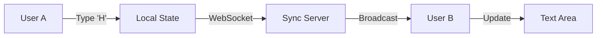

# EtherPly Example: Text Editor

> **Concept**: The "Hello World" of real-time collaboration. Demonstrates basic **LWW (Last-Write-Wins) Register synchronization** for a shared text area.

## Architecture

This example uses the simplest sync primitive: `useDocument`.



### Data Structure
```ts
// Key: "shared-text"
// Value: string
const { value, setValue } = useDocument({ 
    key: 'shared-text',
    initialValue: '' 
});
```

## Run It

### 1. Prerequisites
Ensure the **EtherPly Sync Server** is running (`:8080`).

### 2. Start Application
```bash
npm install
npm run dev
```

### 3. Verify
1. Open `http://localhost:3000` in two windows.
2. Type in Window A.
3. Observe specific character-by-character updates in Window B.

## Troubleshooting

### "Text jumps back"
**Cause**: High latency or race condition with LWW strategy.
**Fix**: This example uses LWW. For production text editing, switch to the `Yjs` or `Automerge` strategy in `etherply-sync-server/main.go`.

### Input loses focus
**Cause**: React re-rendering the entire component on sync update.
**Fix**: Ensure `useDocument` is called at the top level, not inside a loop or conditional.
