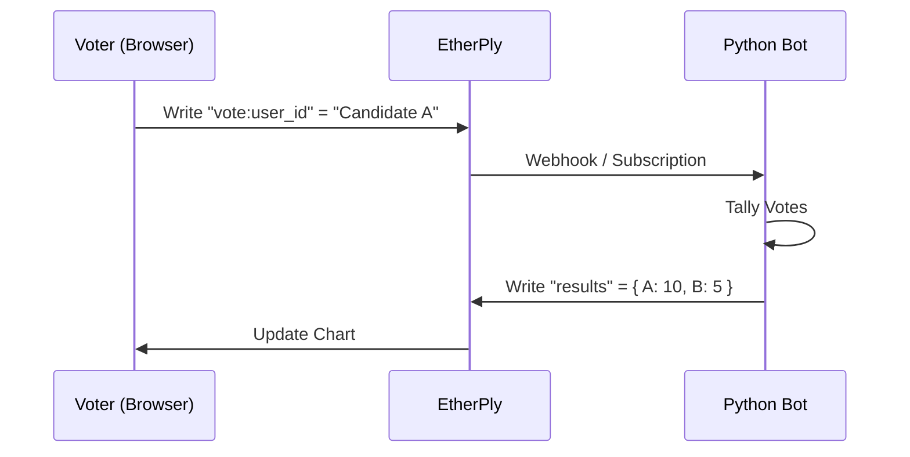

# EtherPly Example: Secure Voting (Bot Pattern)

> **Concept**: Demonstrates a **Server-Authoritative** architecture where frontend clients have *write-only* access to their own vote, and a privileged **Python Bot** aggregates results.

## Architecture

Prevents client-side cheating (e.g., a user directly modifying the 'results' document).



## Run It

### 1. Prerequisites
- **EtherPly Server** running (`:8080`).
- **Python 3.10+** for the bot.

### 2. Start Frontend
```bash
cd frontend
npm install
npm run dev
```

### 3. Start Vote Counter Bot
In a new terminal:
```bash
cd backend
pip install -r requirements.txt
python bot.py
```

### 4. Verify
1. Vote in the browser.
2. Watch the terminal output of `bot.py`.
3. See the chart update only *after* the bot processes the vote.

## Troubleshooting

### Chart never updates
**Cause**: The Python bot is not running or crashed.
**Fix**: Restart `bot.py`. The "results" document is only written by the bot.

### "Permission Denied" (hypothetical)
**Cause**: In a real deploy, the "results" key would be ACL-locked.
**Fix**: Currently managed via convention (Client doesn't know the "results" key or UI doesn't write to it).
